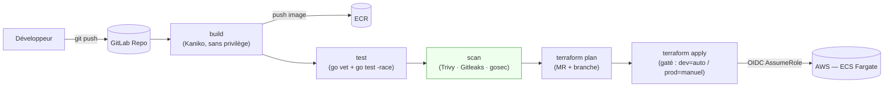
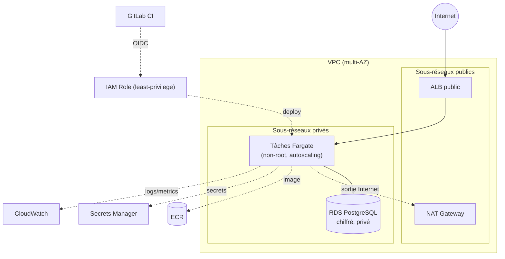

# app-migration-cicd — Migration d'une application vers AWS

Prestation type « société de services » : migrer une application vers AWS de bout en bout —
conteneurisation, infrastructure cible en Infrastructure-as-Code, industrialisation CI/CD
DevSecOps et exploitation des conteneurs. Le dépôt est conçu pour être **auto-suffisant** :
tout se comprend en le lisant, sans réunion.

---

## 1. Objectif

Prendre une application (ici une API Go de démonstration) et livrer la chaîne complète qui permet
de l'exécuter en production sur AWS :

- **Conteneurisation** : image Docker multi-stage, non-root, distroless, avec sonde de santé.
- **Infrastructure cible (IaC Terraform)** : réseau, exécution des conteneurs (**ECS Fargate**),
  base de données managée (**RDS PostgreSQL**), registre d'images (**ECR**), secrets
  (**Secrets Manager**), le tout chiffré et en moindre privilège.
- **CI/CD DevSecOps (GitLab)** : `build → test → scan sécurité → deploy`, authentification AWS
  **par OIDC** (aucune clé statique), déploiement **gaté par branche**.
- **Exploitation** : deux environnements isolés (dev/prod), autoscaling, journalisation centralisée.

> État actuel : le dépôt est complet et **validé statiquement** (fmt, validate, tflint, checkov,
> build d'image, tests Go). **Aucun déploiement réel n'a été effectué** — l'`apply` est volontairement
> laissé à la main de l'exploitant.

---

## 2. Diagrammes

### Flux CI/CD



### Infrastructure cible



---

## 3. Prérequis

| Outil | Version | Usage |
|-------|---------|-------|
| Terraform | ≥ 1.5 | IaC |
| AWS CLI | v2 | bootstrap, push ECR |
| Docker | ≥ 24 | build de l'image |
| tflint | ≥ 0.50 | lint Terraform |
| checkov | ≥ 3 | analyse sécurité IaC |
| Go | 1.23 | tests (ou via conteneur `golang:1.23`) |
| make | — | pilotage (cf. §4) |

Côté AWS : un compte avec droits suffisants pour le **bootstrap** (S3, DynamoDB, IAM/OIDC, KMS).
Côté GitLab : les variables CI/CD listées en tête de [`.gitlab-ci.yml`](.gitlab-ci.yml).

---

## 4. Comment lancer (Makefile)

```bash
make help                 # liste des cibles

# Qualité (statique, sans AWS)
make quality              # fmt + validate + tflint + checkov
make test                 # tests Go (via conteneur, sans installer Go)
make build                # construit l'image conteneur

# Bootstrap (une seule fois — crée le backend distant + le provider OIDC)
make bootstrap-init
make bootstrap-apply      # à lancer manuellement, avec un nom de bucket unique

# Cycle d'un environnement (backend partiel : pas de nom de compte en dur)
make init  ENV=dev  TF_STATE_BUCKET=<bucket-du-bootstrap>
make plan  ENV=dev
make apply ENV=dev        # déploiement réel — à déclencher en connaissance de cause
make destroy ENV=dev
```

> Le pipeline GitLab exécute exactement les mêmes étapes ; le `make` sert au travail local et à
> reproduire la boucle qualité avant tout commit.

---

## 5. Ce que ce projet démontre

- **Conteneurisation soignée** : build multi-stage, image **distroless non-root** (uid 65532),
  système de fichiers racine en lecture seule, sonde de santé intégrée au binaire (pas de shell
  dans l'image), arrêt gracieux compatible avec le cycle de vie ECS.
- **Terraform modulaire et réutilisable** : 6 modules (`vpc`, `ecr`, `secrets`, `rds`,
  `ecs_service`, `iam_oidc_role`) composés par environnement, variables/outputs documentés.
- **Sécurité par défaut** : chiffrement KMS partout (state, RDS, ECR, secrets), réseau privé pour
  l'app et la base, security groups en moindre ouverture, **IAM least-privilege** (aucun `*`
  injustifié ; les `*` imposés par AWS sont commentés), **secrets jamais en dur** (placeholders +
  mot de passe RDS géré par AWS).
- **CI/CD DevSecOps** : authentification **OIDC sans clé statique**, scan image (Trivy), secrets
  (Gitleaks), SAST (gosec), scan IaC (Trivy config) en complément de Checkov, déploiement **gaté
  par branche** avec traçabilité (tag = SHA de commit, environnements GitLab).
- **Exploitation** : environnements **dev/prod isolés** (states séparés), autoscaling CPU,
  VPC Flow Logs et logs applicatifs CloudWatch, tags `Project/Env/Owner/ManagedBy` cohérents.

---

## 6. Choix d'architecture & alternatives écartées

### ECS Fargate **plutôt qu'**EKS *(décision structurante)*
- **Retenu : ECS Fargate.** Serverless (pas de plan de contrôle ni de nœuds à patcher), modèle
  opérationnel simple, coût réduit, intégration native ECR/ALB/IAM/Secrets Manager. Idéal pour une
  application unique migrée vers le cloud.
- **Écarté : EKS.** Apporte tout l'écosystème Kubernetes (Helm, opérateurs, portabilité multi-cloud)
  mais au prix d'un plan de contrôle facturé (~73 $/mois), d'une charge d'exploitation supérieure
  (mises à jour, RBAC, CNI) et d'une complexité non justifiée par un seul service. EKS resterait le
  bon choix pour un parc de microservices ou un besoin fort de portabilité.

### RDS PostgreSQL **plutôt qu'**Aurora
- RDS classique suffit et coûte moins cher pour une charge modérée. Aurora apporterait une meilleure
  élasticité et résilience, à réévaluer si la volumétrie/le trafic croît.

### NAT : une passerelle en dev, une par AZ en prod
- Une NAT unique réduit le coût en dev ; en prod on en place une par zone pour éviter qu'une panne
  de zone ne coupe l'accès sortant des autres.

### OIDC **plutôt que** clés d'accès statiques
- Le pipeline échange un jeton OIDC court-vivant contre des identifiants temporaires
  (`AssumeRoleWithWebIdentity`). Aucune clé longue durée à stocker, faire tourner ou risquer de fuiter.

### Mot de passe RDS géré par AWS
- `manage_master_user_password` délègue génération/rotation à Secrets Manager : le secret n'apparaît
  jamais dans le code ni dans le state Terraform.

> Écarts assumés sur l'analyse Checkov (justifiés dans [`.checkov.yaml`](.checkov.yaml)) : ALB en HTTP
> (démo sans nom de domaine/certificat ACM — bascule HTTPS automatique dès qu'un certificat est
> fourni), WAF/access-logs ALB et rotation des secrets non câblés (coût/périmètre démo), dev
> volontairement plus permissif que prod (multi-AZ, deletion protection).

---

## 7. Questions d'entretien probables + réponses

**Q1 — Comment la CI s'authentifie-t-elle à AWS sans clé d'accès stockée ?**
Par OIDC. Le provider OIDC GitLab est déclaré dans AWS (étape *bootstrap*). À chaque job, GitLab émet
un jeton OIDC signé ; le SDK AWS l'échange via `sts:AssumeRoleWithWebIdentity` contre des
identifiants temporaires. La politique de confiance du rôle restreint l'`aud` **et** le `sub`
(projet + branche précise), donc seul le bon pipeline sur la bonne branche peut assumer le rôle.
Aucune clé longue durée n'existe.

**Q2 — Comment garantissez-vous le moindre privilège et l'absence de secrets en dur ?**
Toutes les politiques IAM sont écrites en ressources/actions explicites ; les rares `*` (ex.
`ecr:GetAuthorizationToken`, `ecs:RegisterTaskDefinition`) sont **imposés par l'API AWS** et commentés.
Les secrets ne transitent jamais en clair : Secrets Manager stocke des placeholders renseignés
hors Terraform, le mot de passe RDS est généré et géré par AWS, et le conteneur reçoit ses secrets
via le mécanisme `secrets` d'ECS (jamais dans les variables d'environnement en clair). Checkov,
Gitleaks et Trivy verrouillent le tout en CI.

**Q3 — Comment isolez-vous dev et prod, et comment évitez-vous d'écraser un environnement ?**
Chaque environnement est une racine Terraform distincte avec un **state séparé** (clés
`dev/terraform.tfstate` et `prod/terraform.tfstate` dans le même bucket, verrou DynamoDB). Le backend
est **partiel** : aucun nom de compte/bucket n'est en dur, ils sont injectés à l'`init`. Les `apply`
sont **gatés par branche** (dev = branche `dev` automatique, prod = branche `main` **manuel**), ce
qui empêche un déploiement croisé. Le verrou DynamoDB interdit deux `apply` concurrents sur le même
state.

---

## Structure du dépôt

```
app/                      API Go + Dockerfile multi-stage non-root
ci/                       templates GitLab CI réutilisables (build/test/scan/deploy)
infra/terraform/
  bootstrap/              backend S3+DynamoDB chiffré + provider OIDC GitLab
  modules/                vpc · ecr · secrets · rds · ecs_service · iam_oidc_role
  environments/           dev · prod (states isolés, backend partiel)
.gitlab-ci.yml            orchestrateur du pipeline
Makefile                  pilotage local (qualité, image, terraform)
```
